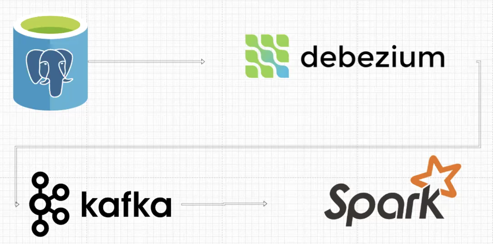

# CDC-Spark
Change Data Capture Project using Google Cloud Platform

## Introduction
This project is a simple implementation of Change Data Capture (CDC). I have used Google Cloud Platform (GCP) Compute Engine as the host for my docker containers. The project uses PostgreSQL as the source database using DBeaver. I have used Debezium to capture the changes in the PostgreSQL database and Kafka to stream the changes in the VM instance. Then I have used Apache Spark in DataBricks to read the data from GCS and perform some SQL operations on the data.

## Technologies Used


## How to run the project
You can run the project in VM instance in GCP, AWS or any other cloud platform or in your local machine. I have used GCP Compute Engine to run the project. You can follow the steps below to run the project in GCP.


### Pre-Steps:
     Go to Network Security -> Firewall Rules -> Create a new firewall rule that allows the following ports:
        1. 9092 (Kafka)
        2. 5432 (PostgreSQL)
        3. 8083 (Debezium)
        4. 8080 (Kafka UI)
    For the source IP ranges, I have used 0.0.0.0/0 for all the ports. This allows all IP addresses to access the ports. You can restrict the IP addresses based on your requirements as this is not recommended for production environments. However, for this project, I have used it for simplicity.

### Step 1: Create a VM instance in GCP
    1. Go to GCP Console and create a new VM instance from Compute Engine. (I have used Debian as the OS for the VM instance)
    2. SSH into the VM instance.
    3. Install docker.io and docker-compose in the VM instance.
        ```
        sudo su
        ```
        Use sudo su to switch to root user and then run the following commands.
        ```
        apt update
        apt upgrade
        apt install docker.io && apt install docker-compose
        ```
    4. Nano into the docker-compose.yml file and copy the contents from the docker-compose.yml file in the repository.(Remember to change the IP address in the KAFKA_ADVERTISED_LISTENERS to the external IP address of the VM instance)
        ```
        nano docker-compose.yaml
        ```
    5. Run the following command to start the docker containers.
        ```
        docker-compose up
        ```    

### Step 2: Set up PostgreSQL
    1. Set up DBeaver in your local machine and connect to the PostgreSQL database in the VM instance.
    2. Create a table using the following SQL command and run the command in DBeaver.
        ```sql	
        -- DB name postgres
        CREATE TABLE IF NOT EXISTS customers (
            id SERIAL PRIMARY KEY,
            first_name VARCHAR(50),
            last_name VARCHAR(50),
            email VARCHAR(100),
            phone VARCHAR(20),
            created_at TIMESTAMP DEFAULT CURRENT_TIMESTAMP
        );
        ```
    3. register-postgres.json file is used to register the PostgreSQL database with Debezium. You can use the following command to register the PostgreSQL database with Debezium.
        ```bash
        curl -i -X POST -H "Accept:application/json" -H "Content-Type:application/json" http://<VM-External-IP>:8083/connectors/ -d @Path/to/register-postgres.json
        ```
    4. Insert some data into the table using the following SQL command.
        ```sql
        INSERT INTO customers (first_name, last_name, email, phone) VALUES ('John', 'Doe', 'example1@email.com', '123456789');
        INSERT INTO customers (first_name, last_name, email, phone) VALUES ('Jane', 'Doe', 'example2@email.com', '987654321');
        INSERT INTO customers (first_name, last_name, email, phone) VALUES ('Alice', 'Doe', 'example4@email.com', '123456789');
        ```
    5. Make some changes in the data in the table and check if the changes are reflected in the Kafka topic.
        ```sql
        UPDATE customers SET first_name = 'Alice1' WHERE id = 3;
        UPDATE customers SET first_name = 'Jane2' WHERE id = 2;
        UPDATE customers SET first_name = 'Alice2' WHERE id = 3;
        ````
    6. Check if the changes are reflected in the Kafka topic using the Kafka UI. Go to http://<VM-External-IP>:8080/ and check if the changes are reflected in the topic.

### Step 3: Set up Apache Spark in DataBricks
    1. Create a new cluster in DataBricks. (Cluster Specs are in the notebook)
    2. Create a new notebook in DataBricks and copy the contents from the CDC-Spark.ipynb file in the repository or import it.
    3. Run the notebook in DataBricks and check if the data is read from the GCS bucket and the SQL operations are performed on the data.

## Conclusion
This project is a simple implementation of Change Data Capture using Google Cloud Platform. The project uses PostgreSQL as the source database, Debezium to capture the changes in the database, Kafka to stream the changes, and Apache Spark in DataBricks to read the data from GCS and perform some SQL operations on the data. The project can be further extended by adding more SQL operations on the data such as filtering the insert or delete and visualizing the data using Tableau, PowerBI and Looker Studio. 

## Future Work
1. Add more SQL operations on the data.
2. Visualize the data using Tableau, PowerBI and Looker Studio.
3. Use more GCP services instead of using docker containers in the VM instance. This can be done by using Cloud SQL for PostgreSQL, Pub/Sub for Kafka, DataProc for Apache Spark and BigQuery for storing the data.
4. Use Airflow to automate the process of running the project.
